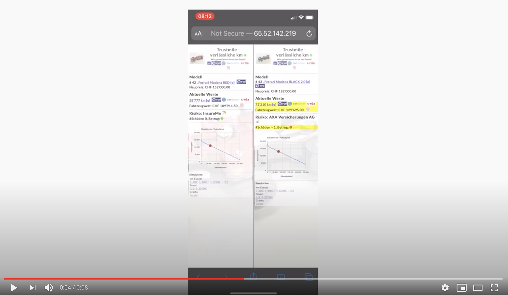
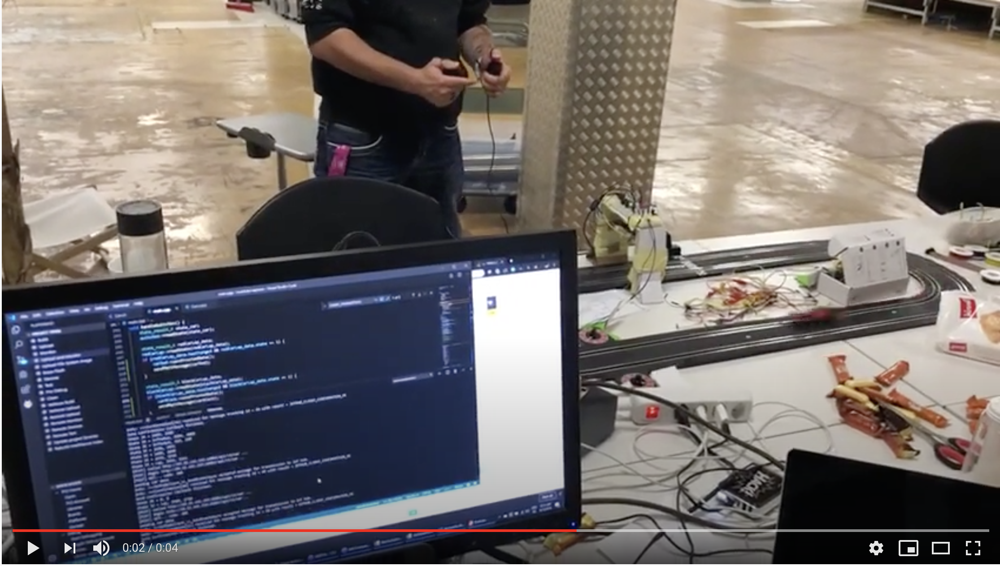
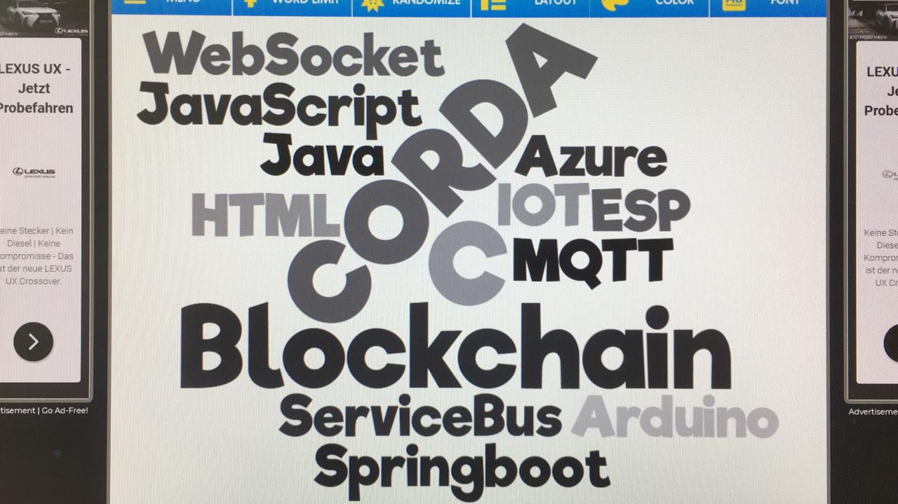
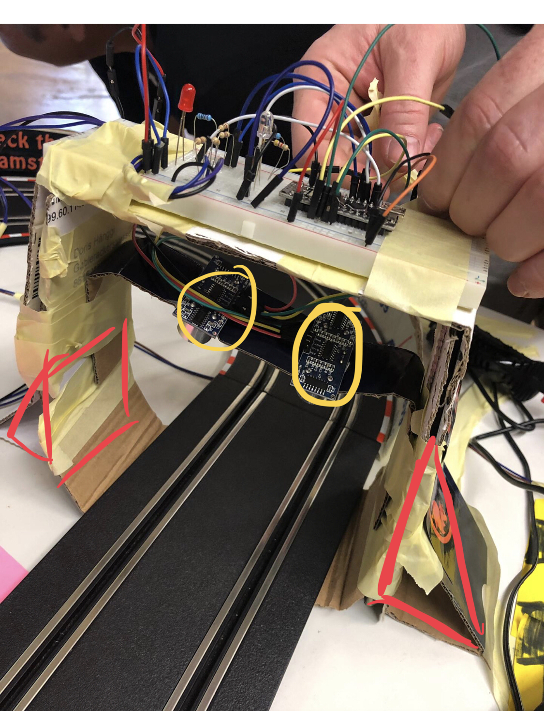
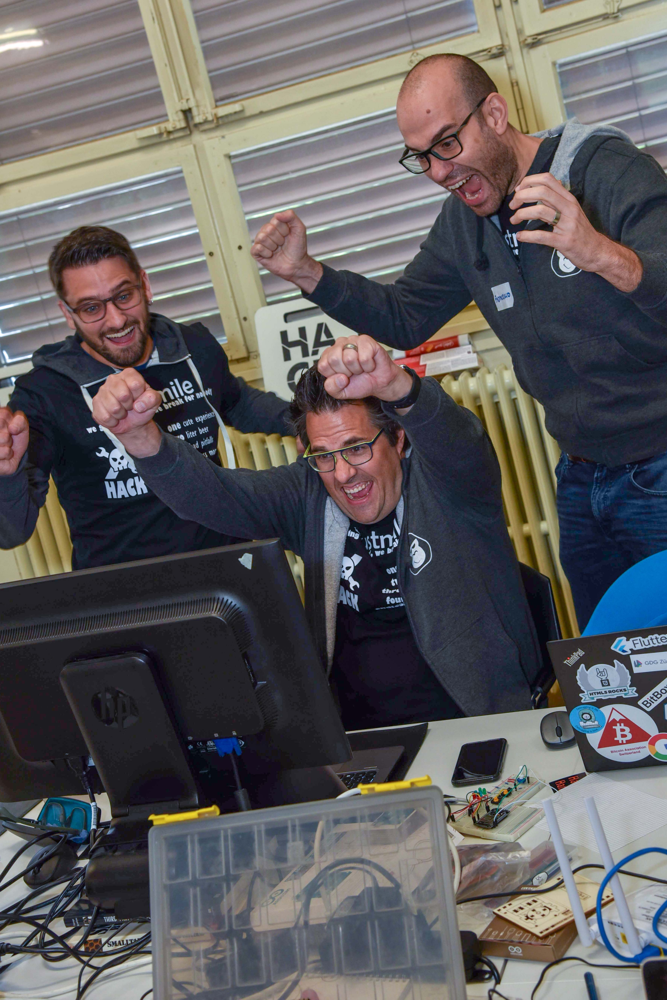
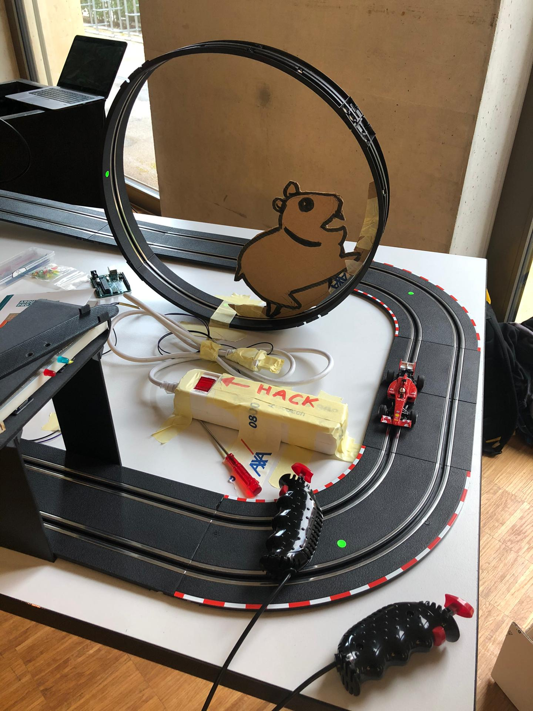
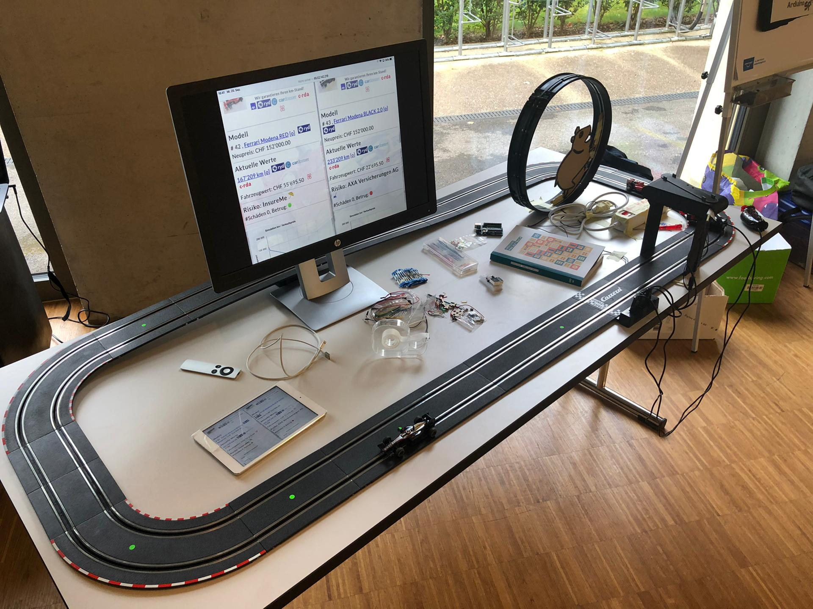
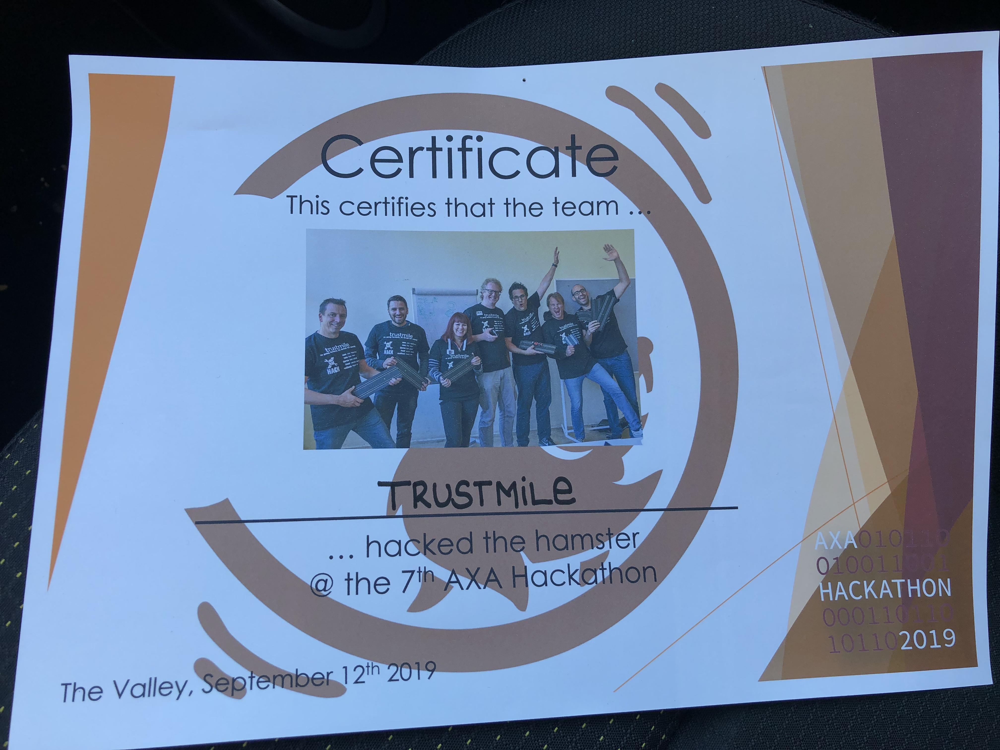
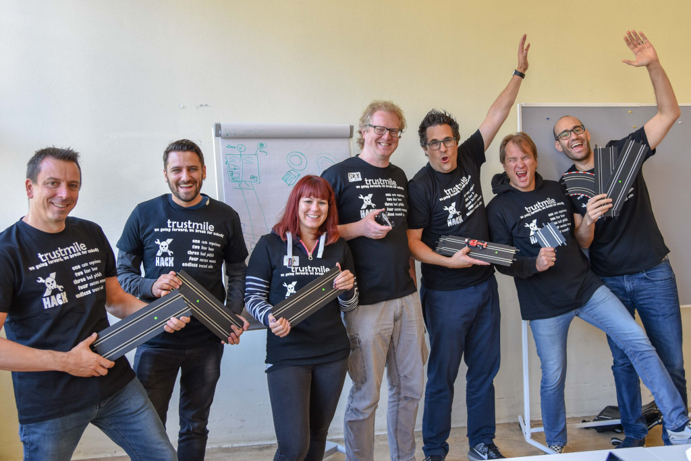

# AXA-Trustmile-corda

At our AXA hackaton 2019 we wanted to show and proof that mileage records can be stored securely, unchangedable into a blockchain using corda DLT: called "trusted miles".
Insurance companies could use this "3rd party trust" to use it as a proof in the policy and therefor allow certain discounts or not.
At the same time insurance companies could detect fraud of "turning back mileage" using the ledger.

## Showcase

how can we showcase this?

- we used a carrera track with 2 speed cars where all the visitors could drive around
- we detected every lap of the 2 tracks using Arduino ESP32 with ultrasound detectors, Led signals with C++
- at every lap we simulated 1000 km and pushed them via [Azure IOT hub, using MQTT](https://docs.microsoft.com/en-us/azure/iot-hub/iot-hub-mqtt-support) to not loose any message
- every message was then received, transformed and sent to CORDA nodes per car
- simple UI using jquery and websockets to display accurate mileage information from CORDA

how can we show that it is secured?
- we have implemented a "HACK" button attached to the arduino
- every "HACK" button pressed, the mileage had been divided by 2 sent to the ledger. The ledger detected a fraud and kept the mileage
- insurance knows that the mileage was hacked

Showcase
 

# Technologies used

# Some pictures 

Picture | Description
------------ | -------------
 | Technologies use
 | Arduino board Hack version
 | During the hack and at a presentaiton 1 week later even using a 3D printed version order it here at [ThingiVerse](https://www.thingiverse.com/thing:3880234) by [Salvador Richter](https://www.thingiverse.com/salvador-richter)
 | Successful 1st mileage stored in CORDA. Thx Manu, Francesco, Lolo

Demo | Demo
------------ | -------------
 | 
 | 

# Team
## Foto

thx to the great team: Sonja, Bernhard, Manu, Sky, Lolo, Salvador, Francesco

